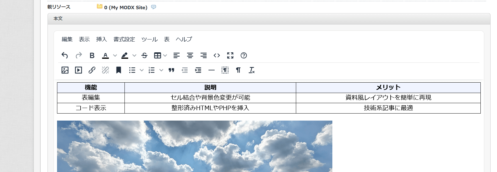

# TinyMCE 7 プラグイン

MODX Evolution で最新の TinyMCE エディターを利用できるようにするプラグインです。

> **ベータ版について**
>
> 現在のリリース (`v0.9.0-beta`) は 1.0.0 未満のベータステータスです。実運用へ導入する場合は、テスト環境で動作を十分に確認したうえでご利用ください。正式版に向けた開発の過程で、設定方法や提供機能が変更される可能性があります。

## 特長

* 文字装飾や画像挿入など、管理画面でのリッチテキスト編集をより快適にします。
* 管理画面・フロントエンドの両方で同じエディター体験を実現します。
* MODX Evolution 標準の MCPuk ファイルブラウザーと連携し、画像やファイルを簡単に選択できます。

## スクリーンショット

## 導入手順

1. プラグイン一式をダウンロードします。
2. FTP で MODX Evolution の設置ディレクトリに接続し、`assets/plugins/tinymce7/` フォルダーを作成します。
3. ダウンロードしたファイルをすべて `assets/plugins/tinymce7/` にアップロードします。
4. 管理画面にログインし、**エレメント → プラグイン** を開きます。
5. 「新規プラグイン作成」をクリックし、ソースコード欄に `tinymce.install_base.tpl` の内容を貼り付けるか、該当ファイルを指定します。
6. プラグイン名を「TinyMCE7」など任意に設定し、以下のイベントを関連付けます。

   * `OnRichTextEditorRegister`
   * `OnRichTextEditorInit`
   * `OnInterfaceSettingsRender`
7. 保存後、リソース編集画面でエディターが有効になっていることを確認します。

## カスタマイズ

* **ツールバー設定**: グローバル設定またはユーザー設定の「TinyMCE7 ツールバー構成」から、シンプル／ベーシック／レガシー／フルの各構成を選択できます。
* **メニューバー表示**: 必要に応じてメニューバーを表示・非表示に切り替えられます。

詳細な設定や開発者向け情報は [TECHNICAL.md](docs/TECHNICAL.md) を参照してください。

## トラブルシューティング

* エラーが発生した場合は、ブラウザーの開発者ツールでコンソールを確認してください。問題の再現手順や取得したログを添えて、GitHub プロジェクトの Issue や Pull Request で報告いただけると助かります。

## ライセンス

本プロジェクトは [MIT License](LICENSE) のもとで公開されています。
